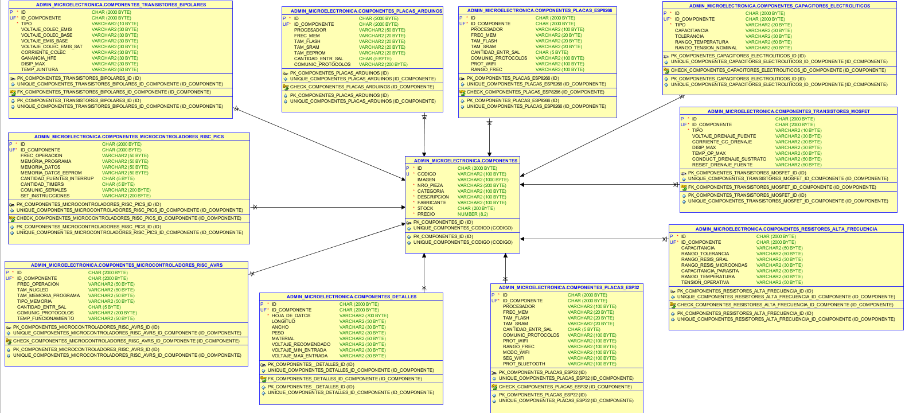

# Base de Datos de microelectrónica | Oracle XE 21c
Base de Datos acerca de Productos de Microelectrónica, tales como transistores, capacitores, resistores de alta frecuencia, etc. Desarrollado con Oracle XE 21c.


<br>

## Índice 📜

<details>
 <summary> Ver </summary>
 
 <br>
 
### Sección 1) Descripción, Tecnologías y Ejecución

 - [1.0) Descripción del Proyecto.](#10-descripción-)
 - [1.1) Ejecución del Proyecto.](#11-ejecución-del-proyecto-)
 - [1.2) Tecnologías.](#12-tecnologías-)
 - [1.3) Relaciones de Tablas.](#13-relaciones-de-tablas-)
 - [1.4) Restricciones de Tablas.](#14-restricciones-de-tablas-)
 
  
### Sección 2) Prueba de Funcionalidad y Referencias
 
 - [2.0) Prueba de Funcionalidad.](#20-prueba-de-funcionalidad-)
 - [2.1) Referencias.](#21-referencias-)

<br>

</details>


<br>

## Sección 1) Descripción, Tecnologías y Ejecución 


### 1.0) Descripción [🔝](#índice-) 

<details>
  <summary>Ver</summary>
 
 <br>
 
## Descripción Técnica


* Se Jerarquiza la información según las categorías de diferentes componentes electrónicos y a su vez sus especificaciones técnicas más relevantes.
* El Proyecto está organizado y modularizado para que cualquier cambio se pueda efectuar de forma eficaz y eficiente
* La Base de Datos describen de forma específica dichos componentes por categoria. Hay componentes que entran en la categoría de Transistores, otros de Capacitores, Resistores, etc.
* Hay tablas que pueden especificar aún más la categoría del componente. Como por ejemplo el componente transistor, los transistores pueden ser de tipo BJT, MOSFET, ETC. Si se crea solamente una tabla por categoría no sería una db normalizada, ya que habría campos que no serían completados porque, en el caso de los transistores, un tipo BJT no tiene las mismas características/parámetros que un MOSFET, este ejemplo aplica para el otros tipos de componentes de la db.
* Se analizó la posibilidad de solamente implementar características genéricas ya que las especificaciones técnicas de todo tipo de componente están indexadas dentro de un datasheet que el fabricante provee, pero teniendo en consideración que esta es una base de datos que puede aplicar como modelo de una real para fabricantes, se toma dichas consideraciones y se agrega un campo para almacenar la hoja de datos del componente y se normaliza con tablas según las categorías de los mismos.
* Una Página de Ejemplo sería http://gmelectronicaweb.com/catalogo/pag108.html , ahí se puede visualizar que se proyectan los datos más relevantes de los componentes sin necesidad de implementar una hoja de datos completa
* Para las Especificaciones de los Transistores me base en la página https://alltransistors.com/es/mosfet/transistor.php?transistor=4 
* Para las Especificaciones de los capacitores y Resistores me base en la página https://ar.mouser.com/c/ds/passive-components/capacitors/aluminum-electrolytic-capacitors/
* Especificaciones de los pics https://www.kynix.com/Detail/10386/PIC18F4520-I%2FPT.html?gclid=Cj0KCQiAxc6PBhCEARIsAH8Hff0_9CtuRscm1qf3-50qS1D_lP8jdspHgQRWw904hpn6nC1sXRh4JnQaAlpxEALw_wcB
* Especificaciones de Arduino https://docs.arduino.cc/resources/datasheets/A000066-datasheet.pdf
* Especificaciones de los Esp8266 https://cdn-shop.adafruit.com/product-files/2471/0A-ESP8266__Datasheet__EN_v4.3.pdf
* Algunos Valores de los Registros Insertados no son completamente verídicos, se prioriza el desarrollo ágil en relación a la información almacenada (los valores pueden ser modificados rápidamente, el desarrollo de la db no ).
* La Base de Datos puede ser Escalable siguiendo el mismo patrón de Normalización del Proyecto, solo se realizaron 10 tablas a modo de aplicación práctica y se modulariza en DDL, DML(INSERTS, UPDATES, DELETES) y QUERIES.

</br>

### Diagrama Entidad Relación  `db_microelectronica`


<br>

</details>


### 1.1) Ejecución del Proyecto [🔝](#índice-)

<details>
  <summary>Ver</summary>
  
 <br>  
  

#### 1.1.0) Configuración de Oracle y Usuarios 
##### (Primeramente deberás descargar el motor de base de datos de oracle, luego algún GDB como por ej. SQLDeveloper y crear el esquema de conexión del usuario o los usuarios de uso. Recordar que oracle trabaja a nivel base de datos con esquemas de conexión que se diversifican a través de ciertas propiedades habilitadas para poder realizar operaciones de datos en la db. No existe en si una conexion para usar varias dbs como postgres o mysql, el concepto de bases de datos en oracle es mas complejo ).

* [Descarga de SQL Developer](https://www.oracle.com/ar/database/technologies/appdev/sqldeveloper-landing.html)
* Ejecutar e Instalar (Siguiente, Siguiente).  
* Oracle nos pide una contraseña para su uso, en mi caso admin(entorno local), en producción se deberá gestionar roles y otros asuntos
* [Descarga de Oracle](https://www.oracle.com/database/technologies/xe-downloads.html)
* Ejecutar el setup.exe e Instalar (Siguiente, Siguiente).
* El proceso de configuración de Oracle lleva un tiempo, también depende de los recursos de cada computadora, pero en sí es lento.


#### 1.1.1) Configuración de Oracle en SQL Developer (Conexión a Oracle).
##### (Como se mencionó anteriormente, el entendimiento de almacenamiento de datos por parte de oracle es más complejo y a su vez acarrea mayor seguridad, por eso cuando nos refiramos a bases de datos, se apunta al esquema de uso en sí, donde se van a poder levantar diferentes tipos de roles(usuarios y permisos), entre otras cosas)


#### 1.1.1.0) Creación de una Conexión de tipo System para usos genéricos
* Click sobre Nueva Conexión.
    * --> En `Name` colocamos `system`
    * --> En `Usuario` colocamos `system`
    * --> En `Contraseña` la ingresada al instalar oracle (en mi caso `admin`)
    * --> El resto lo dejamos todo por defecto ( Host, Port, etc ).
    * --> Testear la conexión con el boton `Probar` o `Test`
    * --> Por último click sobre el botón conectar, luego se pedirá Usuario y Contraseña, ingresar
    * --> Ya está la conexión configurada.


#### 1.1.1.1) Creación de una Conexión para el Esquemas de la Base de Datos
##### ( Vamos a craer un Esquema de Conexión para el manejo de nuestra db por razones de seguridad, en este caso solamente podrán manejar la misma los administradores de esta db con el usuario y contraseña correspondientes, para asignarles ciertos privilegios sobre la misma)
* Primeramente debemos asegurarnos de que se haya establecido correctamente la conexión de tipo system para poder ejecutar lo siguiente
* Aplicaremos el Esquema de Usuarios Administradores a través de un Script
* Primeramente habilitamos la inserción a través de Scripts..
```sql
-- == HABILITAMOS LOS SCRIPTS ==
alter session set "_ORACLE_SCRIPT"=true;

```
* Seguidamente vamos a crear el usuario con sus privilegios para poder utilizar posteriormente la conexión que crearemos
* Creamos el Usuario administradores con su Contraseña..
```sql
-- == CREACIÓN DE USUARIO ==
create user admin_microelectronica identified by admin_microelectronica
```
* No colocamos las ; ya que es una linea de un comando que lo analizaremos por partes
* Creamos el tablespace por defecto, que es la ubicación de almacenamiento donde se pueden guardar los datos/objetos de la base de datos y el tablespace temporal, para guardar los datos en sesion, cuando se desloguee el usuario estos datos se eliminan. Por último el limite de datos para el mismo, en este caso ilimitado, pero depende el area del usuario se le asignará un tamaño fijo
```sql
default tablespace system 
temporary tablespace temp
quota unlimited on system;
```
* Agregamos los privilegios de sesion, creación de tablas, indices, disparadores, procedimientos, secuencias, vistas, etc

```sql
-- == PRIVILEGIOS DEL USUARIO ==
grant create session to admin_microelectronica;
grant create table to admin_microelectronica;
grant create view to admin_microelectronica;
grant create trigger to admin_microelectronica;
grant create procedure to admin_microelectronica;
grant create sequence to admin_microelectronica;


```
* Comando Completo..
```sql
-- == HABILITAMOS LOS SCRIPTS ==
alter session set "_ORACLE_SCRIPT"=true;

-- == ELIMINAMOS EL O LOS POSIBLES USUARIOS CREADOS CON TABLAS, ETC ==
drop user administradores cascade;

-- == CREACIÓN DE USUARIO ==
create user admin_microelectronica identified by admin_microelectronica
default tablespace system 
temporary tablespace temp
quota unlimited on system;


-- == PRIVILEGIOS DEL USUARIO ==
grant create session to admin_microelectronica;
grant create table to admin_microelectronica;
grant create view to admin_microelectronica;
grant create trigger to admin_microelectronica;
grant create procedure to admin_microelectronica;
grant create sequence to admin_microelectronica;


```

#### 1.1.2) Conexión del Usuario admin_microelectronica para nuestra db en Oracle 
* Click sobre Nueva Conexión.
    * --> En `Name` colocamos `db_microelectronica`
    * --> En `Usuario` colocamos el nombre del usuario creado `admin_microelectronica`
    * --> En `Contraseña` colocamos  la contraselña del usuario creado `admin_microelectronica`
    * --> El resto lo dejamos todo por defecto ( Host, Port, etc ).
    * --> Testear la conexión con el boton `Probar` o `Test`
    * --> Por último click sobre el botón conectar, luego se pedirá Usuario y Contraseña, ingresar
    * --> Ya está la conexión configurada.
  
#### 1.1.3) Ejecución de archivos .sql
  * Seguir el orden de ejecución según numeración

<br>

</details>


### 1.2) Tecnologías [🔝](#índice-)

<details>
  <summary>Ver</summary>
 
 <br>

	
| **Tecnologías Empleadas** | **Versión** | **Finalidad** |               
| ------------- | ------------- | ------------- |
| Oracle XE | 21 c  | SGDB  |
| Oracle SQL Developer | 21.4.1  | Gestor de Base de Datos | 
| Git Bash | 2.29.1  | Control de Versiones |
| CMD | 10 | Manipular los Servicios de Oracle mediante linea de comandos | 
	
<br>

</details>


</br>


<br>


## Sección 2) Prueba de Funcionalidad y Referencias


### 2.0) Prueba de Funcionalidad [🔝](#índice-)

<details>
 <summary>Ver</summary>

#### Tabla `componentes`


#### Tabla `componentes_detalles`


#### Tabla `componentes_transistores_bipolares`


* Se acota doc gráfica. Visualizar el resto de las funcionalidades.


<br>

</details>


### 2.1) Referencias [🔝](#índice-)

<details>
 <summary>Ver</summary>


</details>

<br>


<br>

<br>

### `Siguiente sección en proceso de actualización` 

<details>
 <summary>Ver</summary>


## `Documentación y Guía Del Proyecto`
#### (Esta Documentación y Guía que Desarrollé es para la Creación, Configuración, Manejo, etc de la Base de Datos db_microelectroncia con Oracle XE en SQL Developer. Como así también para el Desarrollo de este Proyecto Gestión de Usuarios, Manejo de Posibles Errores, Uso de Git, Consideraciones y Declaraciones del Proyecto, etc. Recomiendo Leerla y Realizar todo paso a paso como se indica en la misma, cualquier aporte o sugerencia, informar al respecto).

## Indice

  #### Sección 1) Configuración de la Base de Datos

  - [ Paso 1) Configuración de Oracle y Usuarios.](#paso-1-configuración-de-oracle-y-usuarios)

  #### Sección 2) Lenguaje de Definición de Datos (DDL)

  - [ Paso 2) Archivo DDL.](#paso-2-archivo-ddl)

  #### Sección 3) Lenguaje de Manipulación de Datos (DML)

  - [ Paso 3) Archivos DML.](#paso-3-archivos-dml)

  #### Sección 4) Consulta de Datos (QUERIES)

  - [ Paso 4) Archivo QUERIES.](#paso-4-archivo-queries)


  
   #### Sección Apéndice
   
   -[ Funciones Implementadas Predefinidas para los Logs del Usuario](#funciones-predefinidas-para-los-logs-del-usuario)


</br>

## Sección 1) Configuración de Oracle y Usuarios

</br>

### Paso 1) Configuración de Oracle y Usuarios 
#### (Primeramente deberás descargar el motor de base de datos de oracle  , luego algún GDB como por ej. SQLDeveloper y crear el esquema de conexión del usuario o los usuarios de uso. Recordar que oracle trabaja a nivel base de datos con esquemas de conexión que se diversifican a través de ciertas propiedades habilitadas para poder realizar operaciones de datos en la db. No existe en si una conexion para usar varias dbs como postgres o mysql, el concepto de bases de datos en oracle es mas complejo ).

#### 1.1) Descarga de SQL Developer
* https://www.oracle.com/ar/database/technologies/appdev/sqldeveloper-landing.html
* Descargar, Ejecutar e Instalar (Siguiente, Siguiente).
* Oracle nos pide una contraseña para su uso, en mi caso admin(entorno local), en producción se deberá gestionar roles y otros asuntos


#### 1.2) Descarga de Oracle
* https://www.oracle.com/database/technologies/xe-downloads.html
* Descargar, Ejecutar el setup.exe e Instalar (Siguiente, Siguiente).
* El proceso de configuración de Oracle lleva un tiempo, también depende de los recursos de cada computadora, pero en sí es lento.


#### 1.3) Configuración de Oracle en SQL Developer (Conexión a Oracle).
#### (Como se mencionó anteriormente, el entendimiento de almacenamiento de datos por parte de oracle es más complejo y a su vez acarrea mayor seguridad, por eso cuando nos refiramos a bases de datos, se apunta al esquema de uso en sí, donde se van a poder levantar diferentes tipos de roles(usuarios y permisos), entre otras cosas)

</br>

#### 1.3.1) Creación de una Conexión de tipo System para usos genéricos
* Click sobre Nueva Conexión.
    * --> En `Name` colocamos `system`
    * --> En `Usuario` colocamos `system`
    * --> En `Contraseña` la ingresada al instalar oracle (en mi caso `admin`)
    * --> El resto lo dejamos todo por defecto ( Host, Port, etc ).
    * --> Testear la conexión con el boton `Probar` o `Test`
    * --> Por último click sobre el botón conectar, luego se pedirá Usuario y Contraseña, ingresar
    * --> Ya está la conexión configurada.


#### 1.4) Creación de una Conexión para el Esquemas de la Base de Datos
#### ( Vamos a craer un Esquema de Conexión para el manejo de nuestra db por razones de seguridad, en este caso solamente podrán manejar la misma los administradores de esta db con el usuario y contraseña correspondientes, para asignarles ciertos privilegios sobre la misma)
* Primeramente debemos asegurarnos de que se haya establecido correctamente la conexión de tipo system para poder ejecutar lo siguiente
* Aplicaremos el Esquema de Usuarios Administradores a través de un Script
* Primeramente habilitamos la inserción a través de Scripts..
```sql
-- == HABILITAMOS LOS SCRIPTS ==
alter session set "_ORACLE_SCRIPT"=true;

```
* Seguidamente vamos a crear el usuario con sus privilegios para poder utilizar posteriormente la conexión que crearemos
* Creamos el Usuario administradores con su Contraseña..
```sql
-- == CREACIÓN DE USUARIO ==
create user admin_microelectronica identified by admin_microelectronica
```
* No colocamos las ; ya que es una linea de un comando que lo analizaremos por partes
* Creamos el tablespace por defecto, que es la ubicación de almacenamiento donde se pueden guardar los datos/objetos de la base de datos y el tablespace temporal, para guardar los datos en sesion, cuando se desloguee el usuario estos datos se eliminan. Por último el limite de datos para el mismo, en este caso ilimitado, pero depende el area del usuario se le asignará un tamaño fijo
```sql
default tablespace system 
temporary tablespace temp
quota unlimited on system;
```
* Agregamos los privilegios de sesion, creación de tablas, indices, disparadores, procedimientos, secuencias, vistas, etc

```sql
-- == PRIVILEGIOS DEL USUARIO ==
grant create session to admin_microelectronica;
grant create table to admin_microelectronica;
grant create view to admin_microelectronica;
grant create trigger to admin_microelectronica;
grant create procedure to admin_microelectronica;
grant create sequence to admin_microelectronica;


```
* Comando Completo..
```sql
-- == HABILITAMOS LOS SCRIPTS ==
alter session set "_ORACLE_SCRIPT"=true;

-- == ELIMINAMOS EL O LOS POSIBLES USUARIOS CREADOS CON TABLAS, ETC ==
drop user administradores cascade;

-- == CREACIÓN DE USUARIO ==
create user admin_microelectronica identified by admin_microelectronica
default tablespace system 
temporary tablespace temp
quota unlimited on system;


-- == PRIVILEGIOS DEL USUARIO ==
grant create session to admin_microelectronica;
grant create table to admin_microelectronica;
grant create view to admin_microelectronica;
grant create trigger to admin_microelectronica;
grant create procedure to admin_microelectronica;
grant create sequence to admin_microelectronica;


```

#### 1.5) Conexión del Usuario admin_microelectronica para nuestra db en Oracle 
* Click sobre Nueva Conexión.
    * --> En `Name` colocamos `db_microelectronica`
    * --> En `Usuario` colocamos el nombre del usuario creado `admin_microelectronica`
    * --> En `Contraseña` colocamos  la contraselña del usuario creado `admin_microelectronica`
    * --> El resto lo dejamos todo por defecto ( Host, Port, etc ).
    * --> Testear la conexión con el boton `Probar` o `Test`
    * --> Por último click sobre el botón conectar, luego se pedirá Usuario y Contraseña, ingresar
    * --> Ya está la conexión configurada.


</br>

## Sección 2) Lenguaje de Definición de Datos (DDL)

</br>

### Paso 2) Archivo DDL 
#### (En este Archivo se definen las estructuras de cada tabla, se crean las secuencias de los identificadores de registros y las Restricciones).

* El modelo de secuencias para cada identificador de PK de cada Tabla es
```sql
create sequence nombre_del_identificador start with 1 increment by 1 nocache nocycle;
```
* Las Restricciones se declaran debajo de la creación de cada Tabla, las mismas son de tipo UNIQUE, CHECK Y FK, además de la PK 


</br>

## Sección 3) Lenguaje de Modelado de Datos (DML)

</br>

### Paso 3) Archivos DML

### Paso 3.1) Archivo DML INSERTS
#### (En este Archivo se insertan los datos de cada tabla).

* La secuencia de inserción parte por la tabla componentes, luego componentes_detalles y seguidamente por cada una de las tablas especificas de cada componente
* Hay datos que no se insertan para poder realizar la manipulación de estos campos en el archivo DML UPDATES
* Por cada inserción se comenta la fuente de datos de los componentes

</br>

### Paso 3.2) Archivo DML UPDATES
#### (En este Archivo se actualizan los datos de cada tabla).

* En cada una de las actualización se especifica que se realiza
* Se actualizan todas las tablas para el testeo de los datos y campos

</br>

### Paso 3.3) Archivo DML DELETES
#### (En este Archivo se eliminan algunos registros de la base de datos).

* En este Script se procede a eliminar e insertar registros de la base de datos.


</br>

## Sección 4) Consulta de Datos (QUERIES)

</br>

### Paso 4) Archivo QUERIES

* En este Script se realizan las consultas necesarias de cada una de las tablas y entre tablas
* Para los registros cuyos campos sean varchar y posean formato numerico indicando su unidad se realizan los cateos de datos pertinentes para su uso
* Es evidente que se puede trabajar con campos numericos para agilizar el tiempo de consulta caso hipotetico de gran cantidad de registros, pero se optó por el manejo de varchar.
* También es posible y considerable reducir nombres, también se optó por el uso de nombres largos por temas de comprensión de implementaciones, esto partirá en base al planteamiento del diseño que se quiera realizar y la lógica de negocio de cada empresa
* Aclarado lo anterior también se acota que se sigue toda la convención de nombres y desarrollo, tanto para tablas, campos, diseño, etc.

<br>

</details>

